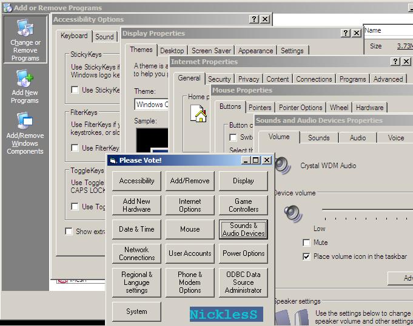



## Shell Control Panel applications

### Description

this code will show you how to shell anything from Control Panel, its easy and simple, please vote.
 
### More Info
 

             |
---                |---
**Submitted On**   |2003-01-01 11:12:02
**By**             |[Ahmad Mami](https://github.com/Planet-Source-Code/PSCIndex/blob/master/ByAuthor/ahmad-mami.md)
**Level**          |Beginner
**User Rating**    |3.6 (18 globes from 5 users)
**Compatibility**  |VB 6\.0
**Category**       |[Coding Standards](https://github.com/Planet-Source-Code/PSCIndex/blob/master/ByCategory/coding-standards__1-43.md)
**World**          |[Visual Basic](https://github.com/Planet-Source-Code/PSCIndex/blob/master/ByWorld/visual-basic.md)
**Archive File**   |[Shell\_Cont152146112003\.zip](https://github.com/Planet-Source-Code/ahmad-mami-shell-control-panel-applications__1-42055/archive/master.zip)

